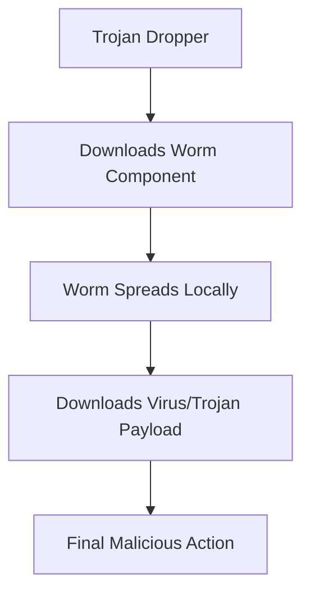

# **Trojan vs Virus vs Worm: Core Concepts Compared**

Here's a clear comparison of these three fundamental malware types, focusing on their **core concepts**, **behavior patterns**, and **evolutionary differences**.

## **Quick Comparison Table**

| **Aspect** | **Trojan Horse** | **Virus** | **Worm** |
|------------|-----------------|-----------|----------|
| **Core Concept** | Disguise as legitimate software | Infect and modify other files | Self-replicate across networks |
| **Replication** | ❌ **No self-replication** | ✅ **Yes, attaches to files** | ✅ **Yes, standalone replication** |
| **Delivery Method** | User deception (must be executed) | Requires host file execution | Automatic network propagation |
| **Primary Goal** | Create backdoor, steal data, download more malware | Corruption, destruction, pranks | Rapid spread, consumption of resources |
| **Human Interaction** | ✅ **Required** (to execute initially) | ✅ **Required** (to execute host file) | ❌ **Not required** |
| **Historical Analogy** | Greek wooden horse (deception) | Biological virus (needs host) | Self-replicating organism (independent) |

---

## **1. TROJAN HORSE**

### **Core Concept: "Deception for Access"**
Named after the Greek myth, a Trojan appears **legitimate but hides malicious intent**.

### **Key Characteristics:**
- **No self-replication** – Doesn't copy itself to other files/systems
- **Requires user execution** – Relies on social engineering
- **Disguise is everything** – Masquerades as:
  - Cracked software, keygens
  - Fake updates (Flash, Java)
  - "Important" documents (invoices, resumes)
  - Useful utilities (system cleaners, converters)

### **Primary Functions:**
1. **Backdoor creation** – RATs (Remote Access Trojans) like SubSeven, Poison Ivy
2. **Data theft** – Banking Trojans (Zeus, Emotet), info-stealers
3. **Downloader/Dropper** – Fetches additional malware
4. **Botnet recruitment** – Turns device into zombie
5. **Ransomware deployment** – The initial dropper

### **Modern Examples:**
- **Emotet** – Started as banking Trojan, evolved into malware delivery service
- **TrickBot** – Modular banking Trojan
- **Remote Access Trojans (RATs)** – DarkComet, NanoCore
- **FakeAV/Scareware** – Fake antivirus software

### **Propagation Method:**
```
User downloads → Executes thinking it's legitimate → Malware installs → May download additional payloads
```

---

## **2. COMPUTER VIRUS**

### **Core Concept: "Parasitic Infection"**
Like biological viruses, computer viruses **require a host and alter it**.

### **Key Characteristics:**
- **Requires a host file** – Attaches to executables, documents, boot sectors
- **Self-replicates** – Copies itself to other files
- **User action required** – Host file must be executed
- **Modifies existing files** – "Infects" them
- **Often destructive** – Corrupts files, displays messages, formats drives

### **Infection Targets:**
1. **File Infectors** – Attach to .exe, .com, .scr files
2. **Macro Viruses** – Infect Word/Excel documents (Melissa, Concept)
3. **Boot Sector Viruses** – Infect MBR (Master Boot Record)
4. **Multipartite Viruses** – Infect both files and boot sectors

### **Historical Examples:**
- **ILOVEYOU** – Spread via email, overwrote files
- **Melissa** – Macro virus in Word documents
- **CIH/Chernobyl** – Corrupted BIOS and data
- **Sasser** – Actually a worm, but often confused as virus

### **Lifecycle:**
```
1. Dormant phase → 2. Host file executed → 3. Replication to other files → 4. Trigger condition met → 5. Payload execution
```

---

## **3. COMPUTER WORM**

### **Core Concept: "Self-Propagating Network Plague"**
Worms are **standalone, self-replicating programs** that spread autonomously.

### **Key Characteristics:**
- **No host file needed** – Independent executable
- **No user interaction required** – Spreads automatically
- **Network-based propagation** – Exploits vulnerabilities
- **Often includes payload** – But spreading is primary goal
- **Consumes resources** – Bandwidth, memory, processing power

### **Propagation Methods:**
1. **Email** – Sends itself to contacts (Outlook worms)
2. **Network shares** – Copies to accessible drives
3. **Instant messaging** – Sends links/files to contacts
4. **Vulnerability exploitation** – Scans for and exploits security holes
5. **Removable media** – USB auto-run worms

### **Famous Examples:**
- **Conficker** – Exploited Windows vulnerabilities
- **Code Red** – IIS web server worm
- **Blaster** – Windows RPC DCOM worm
- **WannaCry** – Ransomware worm (hybrid)
- **Stuxnet** – Targeted industrial control systems

### **Network Propagation:**
```
Scan network for vulnerable systems → Exploit vulnerability → Copy self → Repeat from new host
```

---

## **HYBRID THREATS: The Modern Reality**

Modern malware often **blends these concepts**:

### **1. Worm-Trojan Hybrids**
- **Example:** WannaCry
- **Characteristics:** Spreads like a worm (EternalBlue exploit) but acts like ransomware (Trojan payload)

### **2. Virus-Worm Hybrids**
- **Example:** Nimda
- **Characteristics:** Spreads via email (worm) and infects files (virus)

### **3. Trojan-Downloader-Worm Combinations**
- **Example:** Emotet's evolution
1. **Trojan phase:** User downloads malicious document
2. **Downloader phase:** Fetches Emotet payload
3. **Worm phase:** Spreads to network shares and via email

### **4. Multi-Stage Malware**


---

## **Evolutionary Perspective**

### **1980s-1990s: The "Golden Age" of Viruses**
- Mostly viruses and simple Trojans
- Created by hobbyists for fame/experimentation
- Relied on floppy disks and BBS systems

### **2000s: Rise of Worms & Profit**
- Internet connectivity enabled worm outbreaks
- Trojans became profit-focused (banking, adware)
- Blaster, Sasser, Mydoom worms caused global disruptions

### **2010s-Present: Blurred Lines & Professionalization**
- **Everything is a hybrid** – Clear distinctions faded
- **Trojans dominate** – Most infections start with Trojan-like deception
- **Worms for lateral movement** – Once inside, malware spreads worm-like
- **Modular design** – Single initial vector (Trojan) loads multiple capabilities

---

## **Why Trojans Dominate Today**

1. **Effectiveness:** Social engineering works better than technical exploits
2. **Stealth:** No rapid spreading means slower detection
3. **Targeting:** Can be precisely aimed at valuable targets
4. **Persistence:** Creates long-term access (APTs)
5. **Monetization:** Direct financial theft (banking Trojans) vs. destructive viruses

---

## **Defensive Implications**

### **Against Trojans:**
- **User education** – Primary defense
- **Application whitelisting**
- **Email/content filtering**
- **Least privilege principle**

### **Against Viruses:**
- **Antivirus with signature detection**
- **File integrity monitoring**
- **Macro security settings**
- **Regular backups**

### **Against Worms:**
- **Network segmentation**
- **Patch management**
- **Firewall rules** (block unnecessary ports)
- **Intrusion prevention systems**

### **Against All:**
- **Behavioral detection** (EDR/XDR)
- **Network monitoring for anomalous traffic**
- **Zero Trust architecture**
- **Assume breach mentality**

---

## **Key Takeaway**

While academic distinctions exist, **modern malware is increasingly hybrid**. A typical attack might:
1. Start with a **Trojan** (phishing email with malicious attachment)
2. Use **worm-like** techniques for lateral movement (exploiting EternalBlue)
3. Deploy a **virus-like** payload that corrupts files (ransomware)

The historical concepts matter for understanding **fundamental behaviors**, but defenders must prepare for **blended threats** that exploit multiple propagation methods simultaneously.
