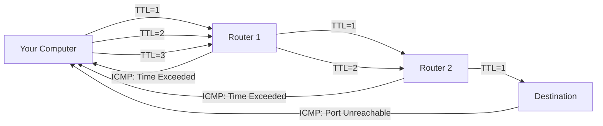

# **TRACEROUTE: THE NETWORK PATHFINDER**

Traceroute is **digital cartography** - it maps the invisible highways between your computer and any destination on the internet. Think of it as following breadcrumbs through the network wilderness.

---

## **HOW TRACEROUTE WORKS: THE ELEGANT TRICK**

### **The Core Principle: TTL Manipulation**
Traceroute exploits the **Time-To-Live (TTL)** field in IP packets. TTL is like an expiration counter that decreases by 1 at each router (hop).

### **The Step-by-Step Magic:**

```
Step 1: Send packet with TTL=1
  → First router receives it
  → TTL becomes 0
  → Router sends back "Time Exceeded" ICMP message
  → You now know Hop 1

Step 2: Send packet with TTL=2
  → Passes through first router (TTL=2→1)
  → Reaches second router (TTL=1→0)
  → Second router sends "Time Exceeded"
  → You now know Hop 2

Repeat until packet reaches destination!
```

### **Visual Flow:**


---

## **TYPES OF TRACEROUTE IMPLEMENTATIONS**

### **1. Traditional Traceroute (Unix/Linux)**
- **Uses:** UDP packets to high port numbers (33434+)
- **Destination replies:** ICMP "Port Unreachable"
- **Command:** `traceroute`

### **2. Windows Traceroute**
- **Uses:** ICMP Echo Request (ping packets)
- **Destination replies:** ICMP Echo Reply
- **Command:** `tracert`

### **3. TCP Traceroute**
- **Uses:** TCP SYN packets (usually port 80)
- **Destination replies:** TCP SYN-ACK or RST
- **Command:** `tcptraceroute` or `traceroute -T`

### **Comparison Table:**

| **Type** | **Protocol** | **Port** | **Advantage** | **Disadvantage** |
|----------|-------------|----------|---------------|------------------|
| **Traditional** | UDP | 33434+ | Most compatible | Blocked by some firewalls |
| **ICMP** | ICMP Echo | N/A | Windows default | Often blocked first |
| **TCP** | TCP SYN | 80/443 | Bypasses firewalls | Requires root/admin |

---

## **ESSENTIAL COMMANDS & SYNTAX**

### **Basic Syntax:**
```bash
# General format
traceroute [options] destination [packet_length]

# Examples
traceroute google.com
traceroute 8.8.8.8
traceroute -n 192.168.1.1  # No DNS resolution
```

---

## **WINDOWS: TRACERT**

### **Basic Command:**
```cmd
tracert google.com
```

### **Common Options:**
```cmd
tracert -d google.com        # No DNS resolution (faster)
tracert -h 30 google.com     # Max 30 hops (default: 30)
tracert -w 1000 google.com   # Timeout = 1000ms (default: 4000)
tracert -j 192.168.1.1 google.com  # Loose source routing
```

### **Example Output:**
```cmd
C:\>tracert google.com

Tracing route to google.com [142.250.185.46]
over a maximum of 30 hops:

  1     1 ms    <1 ms    <1 ms  192.168.1.1
  2    10 ms     9 ms    10 ms  10.10.10.1
  3    12 ms    11 ms    12 ms  96.120.12.17
  4    13 ms    13 ms    14 ms  ae-12-ar01.seattle.wa.example.com [75.149.230.169]
  5    15 ms    14 ms    14 ms  be-301-cr01.seattle.wa.example.com [68.85.158.157]
  6    17 ms    16 ms    16 ms  be-302-cr01.seattle.wa.example.com [68.85.158.153]
  7    18 ms    18 ms    18 ms  be-399-pe02.seattle.wa.example.com [68.85.156.18]
  8    19 ms    19 ms    19 ms  72.14.205.152
  9    20 ms    19 ms    20 ms  108.170.245.113
 10    20 ms    20 ms    20 ms  142.250.185.46

Trace complete.
```

---

## **LINUX/MAC: TRACEROUTE**

### **Basic Command:**
```bash
traceroute google.com
```

### **Common Options:**
```bash
traceroute -n google.com          # No DNS resolution
traceroute -q 5 google.com        # 5 queries per hop (default: 3)
traceroute -w 2 google.com        # Wait 2 seconds for response
traceroute -m 20 google.com       # Max 20 hops
traceroute -f 5 google.com        # Start from hop 5
traceroute -p 33435 google.com    # Use specific port
traceroute -I google.com          # Use ICMP instead of UDP
traceroute -T google.com          # Use TCP SYN (needs root)
traceroute -U google.com          # Use UDP (default)
```

### **Example Output:**
```bash
$ traceroute -n google.com
traceroute to google.com (142.250.185.46), 30 hops max, 60 byte packets
 1  192.168.1.1  0.298 ms  0.245 ms  0.215 ms
 2  10.10.10.1  9.872 ms  9.843 ms  9.825 ms
 3  96.120.12.17  11.923 ms  11.905 ms  11.886 ms
 4  75.149.230.169  13.134 ms  13.116 ms  13.097 ms
 5  68.85.158.157  14.286 ms  14.268 ms  14.249 ms
 6  68.85.158.153  16.472 ms  16.454 ms  16.435 ms
 7  68.85.156.18  18.638 ms  18.619 ms  18.601 ms
 8  72.14.205.152  19.782 ms  19.764 ms  19.745 ms
 9  108.170.245.113  20.912 ms  20.894 ms  20.875 ms
10  142.250.185.46  21.987 ms  21.969 ms  21.950 ms
```

---

## **READING TRACEROUTE OUTPUT: WHAT IT ALL MEANS**

### **Understanding Each Line:**
```
Hop#  Router1  Time1  Time2  Time3  [Hostname]
 1    192.168.1.1  0.5ms  0.4ms  0.3ms  router.local
```

**Breakdown:**
- **Hop#:** Number of routers from source
- **Router IP:** The router at that hop
- **Time1/2/3:** Round-trip times for 3 probes (shows consistency)
- **Hostname:** Reverse DNS lookup of IP (if available)

### **Special Symbols & Their Meaning:**

| **Symbol** | **Meaning** | **Possible Cause** |
|------------|------------|-------------------|
| `* * *` | No response from this hop | Firewall blocking, router configured not to reply |
| `!N` | Network unreachable | Router has no route to destination |
| `!H` | Host unreachable | Destination host down or doesn't exist |
| `!P` | Protocol unreachable | Protocol not supported |
| `!F` | Fragmentation needed | Packet too large, needs fragmentation |
| `!X` | Communication administratively prohibited | Administrative firewall block |
| `10ms 100ms 500ms` | Increasing times | Congestion, routing changes, queuing delays |

---

## **PRACTICAL EXAMPLES & USE CASES**

### **Example 1: Basic Troubleshooting**
```bash
# Why is my website slow?
traceroute example.com

# Output shows:
# 1-5: Fast (1-10ms)
# 6-8: Very slow (200-500ms)  ← PROBLEM HERE!
# 9-10: Fast again
```
**Diagnosis:** Problem at hop 6-8 (likely ISP's upstream provider)

### **Example 2: Identifying Network Boundaries**
```bash
traceroute -n 8.8.8.8
```
```
1  192.168.1.1        # Your router (LAN)
2  10.10.10.1         # ISP modem (WAN)
3  96.120.12.17       # ISP network
4  75.149.230.169     # ISP backbone
5  68.85.158.157      # Internet exchange
6  72.14.205.152      # Google network
7  8.8.8.8           # Destination
```

### **Example 3: Finding Where Connection Fails**
```bash
traceroute unreachable-site.com
```
```
1  192.168.1.1  1ms
2  10.10.10.1   10ms
3  96.120.12.17 12ms
4  75.149.230.169 15ms
5  * * *                    ← CONNECTION FAILS HERE
6  * * *
```
**Conclusion:** The router at hop 4 can reach hop 3, but something between hop 4 and 5 is blocking.

---

## **ADVANCED TRACEROUTE TECHNIQUES**

### **1. Path Comparison (Before/After Changes)**
```bash
# Before VPN
traceroute -n google.com > path_before.txt

# After VPN
traceroute -n google.com > path_after.txt

# Compare
diff path_before.txt path_after.txt
```

### **2. Detecting Asymmetric Routing**
```bash
# Different paths for different packet sizes
traceroute -n -q 1 -p 80 google.com  # Small probe
traceroute -n -q 1 -p 80 -l 1500 google.com  # Large probe
```
**If paths differ:** Network uses load balancing or policy routing.

### **3. Bypassing Firewalls with TCP**
```bash
# Many firewalls block ICMP/UDP but allow TCP 80/443
sudo traceroute -T -p 443 google.com  # TCP to HTTPS port
sudo traceroute -T -p 80 google.com   # TCP to HTTP port
```

### **4. Using Specific Source Interface**
```bash
# If you have multiple network interfaces
traceroute -i eth1 google.com   # Use eth1 interface
traceroute -i wlan0 google.com  # Use wireless interface
```

---

## **TRACEROUTE FOR SECURITY ANALYSIS**

### **Finding Your Network's Exposure:**
```bash
# Trace to known malicious IP
traceroute -n 45.67.89.123

# Output might reveal:
# 1-5: Your ISP
# 6-8: Transit providers
# 9-10: Bulletproof hosting in Russia ← HIGH RISK
```

### **Detecting Man-in-the-Middle Attacks:**
```bash
# Baseline normal path
traceroute bank.com > normal_path.txt

# Suspect MITM? Check current path
traceroute bank.com | tee current_path.txt

# Compare - different intermediate hops = possible MITM
```

### **Identifying Geolocation Anomalies:**
```bash
traceroute example.com
```
```
1  nyc-router.example.net   # New York
2  london-router.example.net # London ← UNEXPECTED!
3  tokyo-router.example.net  # Tokyo
4  example.com              # Should be in NYC
```
**Security Implication:** Traffic being routed through unexpected countries.

---

## **LIMITATIONS & GOTCHAS**

### **1. Load Balancing Can Mislead**
```bash
traceroute google.com
```
Might show different paths for each probe because of load balancers.

### **2. Firewalls Block Traceroute**
Many corporate firewalls block ICMP/UDP traceroute packets.

### **3. Not All Routers Respond**
Some routers are configured not to send "Time Exceeded" messages.

### **4. Asymmetric Paths**
The path TO a destination may be different FROM the destination.

### **5. DNS Resolution Issues**
Reverse DNS might fail, showing only IPs.

---

## **MODERN ALTERNATIVES & COMPLEMENTS**

### **1. MTR (My TraceRoute) - Best of Both Worlds**
```bash
mtr google.com
```
**Combines:** traceroute + ping in continuous mode.

### **2. PathPing (Windows)**
```cmd
pathping google.com
```
**Combines:** traceroute + ping with statistics.

### **3. tcptraceroute**
```bash
sudo tcptraceroute google.com 443
```
**Uses:** TCP SYN packets (harder to block).

### **4. Paris Traceroute**
```bash
paris-traceroute google.com
```
**Handles:** Load balancers and multi-path routing better.

---

## **REAL-WORLD TROUBLESHOOTING SCENARIOS**

### **Scenario 1: Website Slow from Office but Fast from Home**
```bash
# From office
traceroute company-website.com
# Shows: Office → ISP → Cogent → Level3 → Destination (200ms)

# From home
traceroute company-website.com  
# Shows: Home → ISP → Hurricane Electric → Destination (20ms)

# Diagnosis: Office ISP uses poor upstream provider
```

### **Scenario 2: VoIP Calls Dropping**
```bash
# Trace to VoIP server with different packet sizes
traceroute -l 64 voip-server.com    # Small (control traffic)
traceroute -l 1500 voip-server.com  # Large (voice traffic)

# If paths differ: QoS or routing policy affecting voice packets
```

### **Scenario 3: International Site Unreachable**
```bash
traceroute international-site.jp
```
```
1-10: Normal domestic path
11: * * *  # At country border
12-30: * * *
```
**Conclusion:** International link down or heavily firewalled.

---

## **SECURITY AUDIT SCRIPT USING TRACEROUTE**

```bash
#!/bin/bash
# traceroute-audit.sh
echo "=== NETWORK PATH SECURITY AUDIT ==="
echo ""

# Critical destinations to check
targets=("google.com" "8.8.8.8" "bank.com" "vpn.company.com")

for target in "${targets[@]}"; do
    echo "=== Tracing to $target ==="
    traceroute -n -q 1 -w 1 "$target" | head -20
    
    # Check for suspicious countries
    traceroute -n "$target" | grep -E "(ru|cn|ua|by|kz)\.[a-z]" \
        && echo "WARNING: Traffic passing through risky country!"
    echo ""
done

# Check if internal traffic leaves network
echo "=== Checking Internal Routes ==="
traceroute -n 10.0.0.1 | grep -v "192.168\|10\." \
    && echo "ALERT: Internal traffic exiting network!"
```

---

## **PROFESSIONAL INTERPRETATION GUIDE**

### **What Normal Looks Like:**
```
1-3:  <10ms    # Local network
4-8:  10-50ms  # ISP network
9-12: 50-100ms # Internet backbone
13+:  100ms+   # Cross-country/continent
```

### **Red Flags:**
1. **Sudden latency spike** (>100ms increase at one hop)
2. **Packet loss at specific hop** (*** consistently)
3. **Traffic going through unexpected countries**
4. **More than 20 hops** for domestic destinations
5. **Asymmetric paths** for different packet sizes

### **Common Patterns & Their Meaning:**

| **Pattern** | **Likely Cause** |
|-------------|------------------|
| **Consistent *** at one hop | Firewall blocking ICMP/UDP |
| **Increasing then decreasing latency** | Congestion then faster path |
| **Same IP appears multiple times** | Load balancer with multiple interfaces |
| **Private IPs (10.x, 192.168.x)** | Carrier-grade NAT or misconfiguration |
| **Very high latency (>300ms) mid-path** | Satellite link or severe congestion |

---

## **THE BOTTOM LINE**

Traceroute is **more than a troubleshooting tool** - it's a:
- **Network microscope** revealing infrastructure
- **Security auditor** detecting suspicious paths  
- **Performance analyzer** identifying bottlenecks
- **Geopolitical map** showing data sovereignty

**Remember:** The internet isn't a cloud - it's a **series of tubes** (routers and links). Traceroute lets you see inside those tubes. When users say "the internet is slow," traceroute answers **WHICH part** of the internet and **WHY**.

**Final Pro Tip:** Always run traceroute **WITHOUT DNS first** (`-n` or `-d`). If you see problems, then run with DNS to identify where. DNS failures can mask real routing issues.
